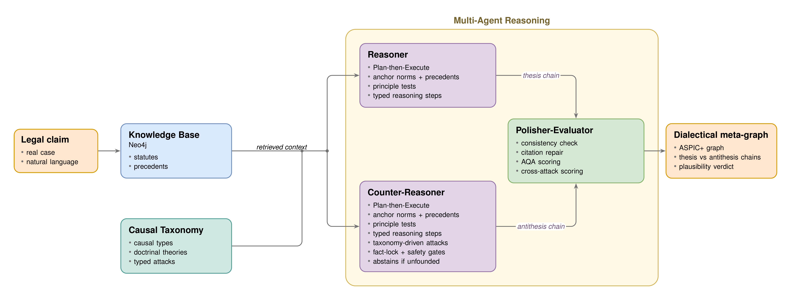
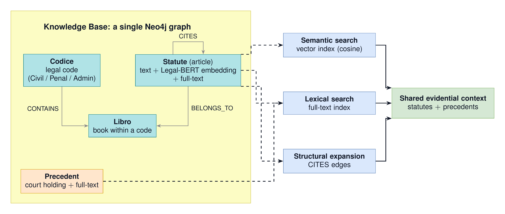
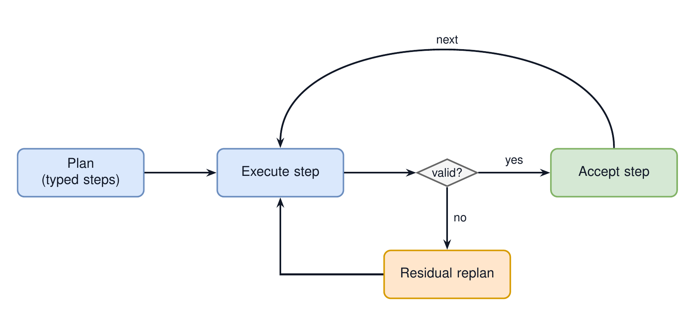
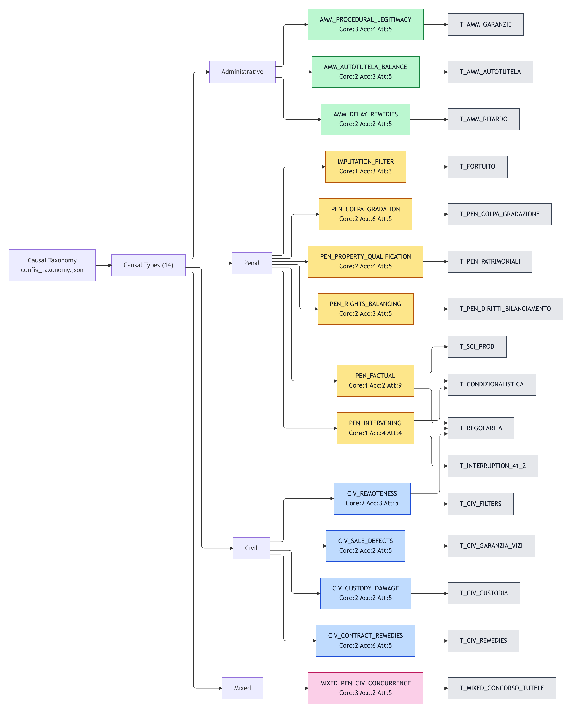
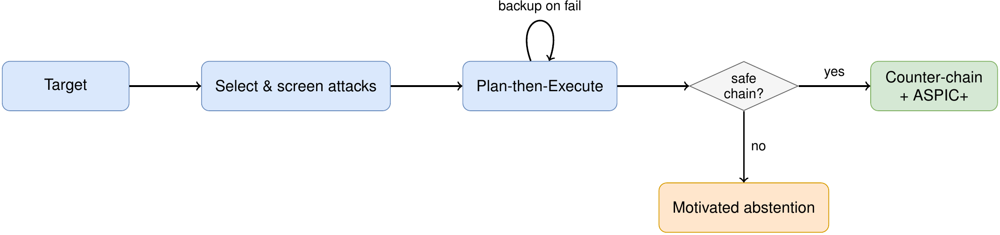
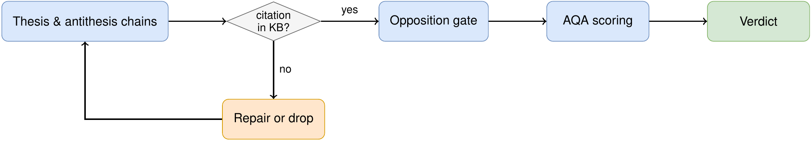
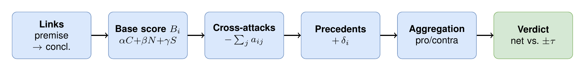

# LexCausa: Framework for Causal-Aware Structured Multi-Step Reasoning in Legal Argument Generation

<p align="center">
   
   
   
   
   
   
   
   
   
</p>

> 🎓 **Master's thesis project** in Computer Engineering at the University of Naples Federico II, defended in July 2026. The framework and its 720-run experimental campaign are complete; the walkthrough below mirrors the thesis defense, and the "Future Work" section lists planned extensions.

**LexCausa** is an AI-powered legal reasoning system for Italian law. It combines Knowledge Graphs (Neo4j), Large Language Models (via three interchangeable backends: Groq Cloud, OpenRouter, and in-process vLLM for HPC), and structured causal reasoning to analyze legal claims, find relevant statutes/precedents, and build a **dialectical meta-graph** (a thesis chain, an antithesis chain that attacks it, and a scored plausibility verdict) instead of free-form prose.

<p align="center">
   
</p>


## 🎯 Features

**Retrieval & Knowledge Base**
- **Neo4j Knowledge Graph**: statutes, precedents, and causal relationships in a single graph
- **Claim Classification & Domain Router**: LLM classifies/routes claims as CIVILE, PENALE, AMMINISTRATIVO, or ENTRAMBI
- **Hybrid Statute Retrieval**: Legal-BERT embeddings + Neo4j fulltext (rank fusion) over 4200+ Normattiva statutes, with source/book pre-filtering
- **Citation Graph Expansion (CITES)**: seed statutes expanded via `(:Statute)-[:CITES]->(:Statute)` before LLM filters
- **Progressive Search**: adaptively expands results when post-filtering yields too few statutes
- **Pre-Retrieval LLM Filtering**: soft relevance filtering (default-YES: discards only clearly irrelevant items)
- **Shared Retrieved Context**: Reasoner and Counter-Reasoner build opposing arguments from the same evidence base
- **Claim Context Memory (SQLite)**: optional cache of final applicable statutes/precedents, reusable across runs and warmable via script

**Reasoning Agents**
- **Unified Pipeline**: Search, Reasoning, Full Pipeline, and DoE share one thread-safe `LegalSearchPipeline` singleton
- **Plan-then-Execute Generation**: agents draft a 3–10 step plan, then generate one validated step per objective
- **Reasoner**: structured ASPIC+ chains (Premise → Statute → Precedent → Causal Link → Conclusion) with causality classification and a taxonomy-anchored causality bootstrap
- **Counter-Reasoner**: taxonomy-driven attacks with fact-lock (no inverted facts), feasibility filtering, abstention when unfounded, plus second-pass retrieval and multi-attack step expansion
- **Repetition Detection**: Jaccard similarity (threshold 0.70) prevents duplicate reasoning steps
- **Causality Taxonomy**: structured Material/Legal/Concurrent taxonomy driving arguments and attacks

**Evaluation & AQA**
- **Polisher-Evaluator**: modular mixin architecture (Consistency + Scoring + NLPUtils + AQAEngine) closing the dialectical loop with a final verdict
- **Consistency Checker**: verifies citations against Neo4j, classifies core/peripheral articles, repairs mismatches via constrained rewriting, drops unreliable citations
- **AQA (Argument Quality Assessment)**: three-dimensional scoring across Cogency (α), NormSupport (β), and Semantics (γ), with configurable weights
- **Cross-Attack Computation**: domain-aware engine with NLI contradiction detection and 6 attack types (contradiction, exception, derogation, extinction, factual_impediment, general_opposition) with per-type damage multipliers
- **Precedent Influence Scoring**: precedent delta from recency, bindingness (cassazione/appello/tribunale), stance confidence, and semantic similarity
- **Attack Coverage Scoring**: bonus for counter-argumentation breadth with diminishing-return weights (1st hit 100%, 2nd 30%, 3rd 10%)
- **Counter-Reasoner Abstention Gate**: classifies counters as OPPOSING_STRONG / OPPOSING_LIMITATIVE / AGREEING / UNCLEAR; weak/agreeing counters skip AQA
- **Attack Precondition Evaluation**: LLM verification of taxonomy preconditions (SATISFIED/UNSATISFIED/UNCLEAR) with intra-run caching
- **Reasoner Plausibility Locking**: optional freeze of reasoner-side plausibility to isolate counter-reasoner effects in A/B tests

**Experiments (DoE / Multi-DoE)**
- **DoE A/B Workflow**: one shared Reasoner vs. baseline/treatment Counter+Evaluator, live A/B switching, consolidated logs and automatic delta analysis
- **DoE Batch Runner**: automated multi-claim runs (`run_doe_batch.py`) with resume, checkpoint recovery, selective/dry-run modes, and stability metrics
- **DoE Statistical Analysis**: paired t-tests, sign tests, Cohen's d, domain breakdowns, verdict flips, and intra-claim consistency
- **Multi-DoE Framework**: full-factorial Reasoner×Counter with deterministic sharding and shared claim-context cache. It produced the thesis campaign of **720 runs** (2 model classes × 2 roles × 3 reasoning paradigms × 12 claims × 5 replicas) on OpenRouter/DeepInfra

**LLM Backends & Infrastructure**
- **Triple LLM Backend** (`LLM_BACKEND`): the same agents run unchanged on **Groq Cloud**, **OpenRouter** (provider-pinned routing, reasoning-effort/token control), or **in-process vLLM** (HPC/Ibisco, chain-of-thought stripping); backend-specific alias maps are code-owned in `src/config.py`
- **Resilient LLM Client**: retry with exponential backoff, dynamic key discovery (V1..V99), model fallback, model-down cache, and smart error classification
- **Per-Role Model Fallback**: independent fallback chains and default temperatures for Reasoner and Counter-Reasoner
- **Centralized Prompt Registry**: 100+ prompts in one `prompt_registry.py` with a typed `PromptKey` enum
- **Centralized Configuration**: 150+ parameters via `src/config.py` (Pydantic Settings), overridable per-request
- **Caching & Filtering Efficiency**: intra-run caching for legal-context, applicability, preconditions, fact-lock, and plan alignment, plus the SQLite claim-context cache
- **Cancellation & Interruptibility**: pipeline stop endpoint with cooperative cancellation across API, agents, and long loops
- **Logging & Artifacts**: per-claim run logs (`logs/<timestamp>_<slug>.log`), consolidated DoE reports, and auto-saved PDF exports

**Frontend (React 19 + Vite)**
- **Five-Tab Interface**: Search, Reasoning, Full Pipeline, DoE A/B, and Multi-DoE
- **ASPIC+ Metagraph Visualization**: interactive SVG meta-graph with PRO/CONTRA columns, curved attack arrows with damage values, and a detail panel
- **Attack Text Details**: expandable panel with full attacker/target text, type, multiplier, NLI label, overlap, and damage per cross-attack
- **Settings Panel**: configure per-step model, temperature, max tokens, search params, AQA weights, chain bounds, and attack params without touching code
- **Live Pipeline Streaming**: real-time phase progress and token streaming (incl. retries) over SSE for full pipeline, Counter-Reasoner, and Evaluator


## 🏗️ Agent and Pipeline Architecture

```
┌─────────────────────────────────────────────────────────────────────────┐
│                       Frontend (React + Vite)                           │
│ Search │ Reasoning │ Full Pipeline │ DoE (A/B) │ Multi-DoE │ ⚙️ Settings │
│      + ASPIC+ Metagraph SVG + Attack Details + PDF Export               │
└─────────────────────────────────────────────────────────────────────────┘
                                  │
                                  ▼
┌─────────────────────────────────────────────────────────────────────────┐
│                     Flask API Server (:8000)                            │
├─────────────────────────────────────────────────────────────────────────┤
│  GET  /health              → Health check with API version              │
│  GET  /api/settings        → Defaults & available models                │
│  POST /api/chat            → LegalSearchPipeline (unified retrieval)    │
│  POST /api/chat/stream     → Search SSE live streaming                  │
│  POST /api/reason          → Reasoner (iterative chain generation)      │
│  POST /api/reason/stream   → Reasoner SSE live streaming                │
│  POST /api/counter_reason  → Counter-Reasoner (iterative counter-chain) │
│  POST /api/counter_reason/stream → Counter-Reasoner SSE                 │
│  POST /api/pipeline        → Full Pipeline (Router→Reasoner→Counter→AQA)│
│  POST /api/pipeline/stream → Full Pipeline SSE token streaming          │
│  POST /api/pipeline/stop   → Stop active SSE pipeline run               │
│  POST /api/evaluate        → Polisher-Evaluator (standalone evaluation) │
│  POST /api/evaluate/stream → Polisher-Evaluator SSE                     │
│  GET  /api/stats           → Runtime usage stats (calls + tokens)       │
│  POST /api/stats/reset     → Reset runtime usage stats                  │
│  POST /api/doe/log         → Consolidated DoE log/report persistence    │
│  POST /api/doe/advanced/run        → Launch Multi-DoE batch          │
│  GET  /api/doe/advanced/status/<id>→ Poll Multi-DoE run status       │
│  POST /api/pdf/export      → Persist exported PDF artifacts             │
└─────────────────────────────────────────────────────────────────────────┘
                                  │
                    ┌─────────────┴─────────────┐
                    ▼                           ▼
┌──────────────────────────────┐  ┌──────────────────────────────────────┐
│  Resilient LLM Client        │  │  LegalSearchPipeline                 │
│  (groq_client.py dispatch)   │  │  (Singleton, thread-safe)            │
├──────────────────────────────┤  ├──────────────────────────────────────┤
│  LLM_BACKEND selector:       │  │  ClaimClassifier → book routing      │
│   groq │ openrouter │ local  │  │  Hybrid retrieval (vector + fulltext)│
│  Key rotation + model fallbk │  │  Progressive + CITES expansion       │
│  Smart error classification  │  │  Pre-retrieval LLM filtering         │
│  Exponential backoff         │  │  Shared Retrieved Context            │
└──────────────────────────────┘  └────────────────┬─────────────────────┘
                    │                              │
                    │         ┌────────────────────┘
                    ▼         ▼ statutes + precedents
┌─────────────────────────────────────────────────────────────────────────┐
│              Reasoner / Counter-Reasoner / Polisher-Evaluator           │
├─────────────────────────────────────────────────────────────────────────┤
│  Reasoner: iterative primary chain on shared retrieved context (ASPIC+) │
│  Counter-Reasoner: iterative attack chain on shared retrieved context   │
│  Polisher-Evaluator (4 Mixins):                                         │
│    ├─ ConsistencyChecker: KB verification → citation repair/drop        │
│    ├─ ScoringMixin: readability, coherence, argument quality            │
│    ├─ NLPUtilsMixin: Flesch/FOG/SMOG, NLI via LLM                       │
│    └─ AQAEngine: Cogency(α)+NormSupport(β)+Semantics(γ)→verdict         │
│         └─ Cross-attacks (6 types) + precedent influence → net_plaus.   │
└─────────────────────────────────────────────────────────────────────────┘
                                  │
                                  ▼
┌─────────────────────────────────────────────────────────────────────────┐
│                   Neo4j Knowledge Base + Taxonomy                       │
├─────────────────────────────────────────────────────────────────────────┤
│  📚 Italian statutes KB (Normattiva): Civil + Penal + Administrative    │
│     (L. 7 agosto 1990, n. 241)                                          │
│  ⚖️  9112 precedent chunks from 792 rulings (ITA-CaseHold)              │
│  📊 768-dim Vector Index (Legal-BERT) on statutes                       │
│  🔗 Statute citation edges: `CITES` from normalized reference fields    │
│  🔗 Causality taxonomy (Material, Legal, Concurrent)                    │
└─────────────────────────────────────────────────────────────────────────┘
```

### Knowledge Base & retrieval

A single Neo4j graph holds the statutes, the precedents, and the citation edges between articles. Every claim is grounded once through three complementary retrievals (**semantic** via Legal-BERT, **lexical** via fulltext, and **structural** via `CITES` expansion), and the resulting context is shared verbatim by the Reasoner and the Counter-Reasoner.

<p align="center">
   
</p>

### Plan-then-Execute generation

Instead of asking the model for a whole argument in one shot, each agent first drafts a **plan** (3–10 typed objectives), then generates and validates **one step per objective**, with local re-planning when a step fails. This keeps the chain from drifting or contradicting itself.

<p align="center">
   
</p>

### Causal taxonomy

Legal responsibility turns on the causal link between conduct and event, so the taxonomy is the backbone of the framework: a single **versioned artifact** (`config_taxonomy.json`), not something hidden inside prompts. It catalogs **14 causal types** across the four legal domains (penal, civil, administrative, mixed); each type maps to its governing **doctrinal theory** and carries anchor norms (core/accessory) and a pool of typed counter-attacks (**16 theories · 66 typed attacks** overall). This is what injects domain-specific causality into the agents: for the running penal case, for instance, it surfaces factual causation (Art. 40), intervening cause (Art. 41), and gradation of fault.

<p align="center">
   
</p>

### Counter-Reasoner

The antithesis is disciplined, not arbitrary: the Counter-Reasoner **selects attacks from the taxonomy** (never invents them), respects a **fact-lock** (no new or inverted facts), applies feasibility filtering, and **abstains with a reason** when no well-founded objection exists.

<p align="center">
   
</p>

### Polisher-Evaluator

The Polisher-Evaluator closes the loop: it checks every citation against the Neo4j graph, repairs incomplete references, classifies the counter as opposing/agreeing (abstention gate), and scores the exchange.

<p align="center">
   
</p>

### AQA scoring

Every link of both chains gets a deterministic base score, the weighted mean of **Cogency** (how well the step stands on its own), **NormSupport** (how anchored it is in the law), and **Semantics** (how on-topic it stays). From that base the engine **subtracts** the antithesis attacks weighted by type, **adds** the precedent contribution, aggregates the two chains, and emits the verdict: *plausible*, *implausible*, or *uncertain*.

<p align="center">
   
</p>

## 📋 Prerequisites

- **Python**: 3.11.x or 3.12.x
- **Docker**: For running Neo4j
- **Node.js**: 18+ (for frontend)
- **Poetry**: Python dependency management
- **LLM provider key** (one of):
  - **Groq API Key**: free tier at [console.groq.com](https://console.groq.com) (default backend)
  - **OpenRouter API Key**: paid, at [openrouter.ai](https://openrouter.ai) (`LLM_BACKEND=openrouter`)
  - none: for in-process vLLM on HPC (`LLM_BACKEND=local`, models loaded from the HF cache)

### Supported Platforms
- ✅ macOS (Apple Silicon M1/M2/M3)
- ✅ macOS (Intel)
- ✅ Windows 10/11 (x64)
- ✅ Linux (x64)

## 🚀 Installation

### 1. Clone the Repository

```bash
git clone https://github.com/yourusername/LexCausa.git
cd LexCausa
```

### 2. Install Python Dependencies

**macOS/Linux:**
```bash
# Install Poetry if not already installed
curl -sSL https://install.python-poetry.org | python3 -

# Install dependencies
poetry install --no-root
```

**Windows (PowerShell):**
```powershell
# Install Poetry
(Invoke-WebRequest -Uri https://install.python-poetry.org -UseBasicParsing).Content | python -

# Install dependencies
poetry install --no-root
```

Or use the project helper target (backend + frontend dependencies):

```bash
make setup
```

### 3. Configure Environment

Create a `.env` file in the project root (starting from `.env.example`):

```bash
cp .env.example .env
```

Then fill in your values:

```env
# Neo4j Configuration
NEO4J_URI=bolt://localhost:7687
NEO4J_USER=neo4j
NEO4J_PASSWORD=your_password_here

# API Server
API_HOST=0.0.0.0
API_PORT=8000
DEBUG=false

# LLM backend: groq (default) | openrouter | local (vLLM/HPC).
# Prefer selecting it per-command instead of pinning it here:
#   LLM_BACKEND=openrouter poetry run python src/api_server.py

# Groq Cloud (LLM_BACKEND=groq): key rotation via V1..V99
GROQ_API_KEY_V1=your_groq_api_key_here
GROQ_API_KEY_V2=your_second_key_here

# OpenRouter (LLM_BACKEND=openrouter): paid, provider-pinned
OPENROUTER_API_KEY=your_openrouter_key_here
OPENROUTER_AUX_MODEL=llama_4_scout          # fixed aux (retrieval/classifier/evaluator)
# OPENROUTER_PROVIDER_ONLY=["deepinfra"]    # JSON list: provider preference order
# OPENROUTER_REASONING_MAX_TOKENS=6000      # cap thinking-model reasoning tokens

# vLLM / HPC (LLM_BACKEND=local): GPU params read at model load
# VLLM_TENSOR_PARALLEL_SIZE=2
# VLLM_GPU_MEMORY_UTILIZATION=0.90
# VLLM_MAX_MODEL_LEN=30000
```

See `.env.example` for the complete, commented template.

### 4. Start Neo4j Database

```bash
docker compose up -d
```

Wait for Neo4j to start (check at http://localhost:7474).

### 5. Initialize the Knowledge Base

```bash
poetry run python src/db/db_orchestrator.py
```

This will:
- Create schema (indexes, constraints, graph structure)
- Load Civil Code, Penal Code, and Administrative Law (L. 241/1990) from `*_normattiva.csv` with embeddings
- Build statute citation edges `(:Statute)-[:CITES]->(:Statute)` from normalized internal references
- Load ITA-CaseHold precedents metadata (no embeddings)
- Wait for indexes to come online (vector for statutes, fulltext for precedents)

Use `--clean` for a full wipe and reload, or `--check` to inspect database status.

### 6. Install Frontend Dependencies

```bash
cd src/frontend
npm install
```

### 7. Run the Application

Recommended one-command startup:

```bash
make dev
```

Stop local stack:

```bash
make dev-stop
```

Manual alternative (two terminals):

```bash
# Terminal 1: Start the API server
poetry run python src/api_server.py

# Terminal 2: Start the frontend dev server
cd src/frontend && npm run dev
```

The frontend will be available at `http://localhost:5173` and the API at `http://localhost:8000`.

### Runtime Usage Stats

The backend now tracks runtime counters for:
- API calls by endpoint
- LLM calls by provider/model/source
- Prompt/completion/total token usage (when provider metadata is available)

Query current stats:

```bash
curl http://localhost:8000/api/stats
```

Reset counters:

```bash
curl -X POST http://localhost:8000/api/stats/reset
```

Snapshots are persisted under `logs/usage_stats/` (`latest.json` plus per-session files).

## 📁 Project Structure

```
LexCausa/
├── src/
│   ├── config.py                  # Centralized configuration (150+ Pydantic Settings)
│   ├── api_server.py              # Flask API server (DoE, SSE, PDF export endpoints)
│   ├── agents/                    # LLM agents with explicit orchestration
│   │   ├── base.py               # Base agent class + progressive search + filters 
│   │   ├── router.py             # Domain router (CIVIL/PENAL/BOTH)
│   │   ├── reasoner.py           # Iterative reasoning agent (ASPIC+)
│   │   ├── counter_reasoner.py   # Iterative counter-argumentation agent (ASPIC+)
│   │   ├── polisher_evaluator.py # Mixin compositor (Consistency+Scoring+NLP+AQA)
│   │   ├── aspic_formatter.py    # ASPIC+ IR formatting
│   │   ├── evaluation/           # Evaluation sub-package (modular mixins)
│   │   │   ├── models.py         # Dataclasses (CitationCheck, ConsistencyReport, etc.)
│   │   │   ├── consistency_checker.py  # KB verification, citation repair, chain regen
│   │   │   ├── aqa_engine.py     # AQA pipeline, cross-attacks, precedent influence
│   │   │   ├── scoring.py        # Readability, coherence, argument quality scoring
│   │   │   └── nlp_utils.py      # Flesch/FOG/SMOG, NLI via LLM, text utilities
│   │   └── tools/                # Agent tools
│   │       ├── neo4j_tools.py    # Neo4j hybrid search pipeline
│   │       ├── prompt_registry.py # Centralized prompt registry (100+ PromptKey enum)
│   │       ├── taxonomy_tools.py # Causality taxonomy
│   │       ├── config_loader.py  # Taxonomy config loader
│   │       └── config_taxonomy.json
│   ├── services/                  # Core services
│   │   ├── groq_client.py        # Resilient LLM client + backend dispatch (groq/openrouter/local)
│   │   ├── openrouter_client.py  # OpenRouter backend (OpenAI SDK, provider-pinned, reasoning ctl)
│   │   ├── vllm_client.py        # In-process vLLM backend (HPC/Ibisco, CoT stripping)
│   │   ├── claim_classifier.py   # LLM claim classification
│   │   ├── claim_context_memory.py # SQLite pre-retrieval claim context cache
│   │   ├── pipeline_control.py   # Cooperative cancellation primitives/exceptions
│   │   ├── usage_stats.py        # Runtime API/LLM usage stats collector
│   │   └── legal_search.py       # Hybrid legal search pipeline (vector + fulltext fusion)
│   ├── db/                        # Database management
│   │   ├── db_orchestrator.py    # Full DB lifecycle (clean/schema/load/verify)
│   │   └── data_loader.py        # Centralized data loading (CSV/parquet + statute embeddings)
│   ├── data/                      # Data files
│   │   ├── embeddings/           # Pre-computed embeddings (.npy)
│   │   ├── precedents/           # ITA-CaseHold precedents (parquet)
│   │   └── statutes/              # Civil + Penal + Administrative CSVs (`*_normattiva.csv`)
│   └── frontend/                  # React frontend (Vite + React 19)
│       └── src/
│           ├── App.jsx            # Main app with Search/Reasoning/Pipeline/DoE tabs
│           ├── AspicMetagraph.jsx # ASPIC+ meta-graph SVG visualization
│           └── AttackTextDetails.jsx # Cross-attack detail panel
├── scripts/                       # Utility scripts
│   ├── analyze_doe_results.py    # Statistical analysis of DoE A/B batch results
│   ├── analyze_multi_doe.py   # Statistical analysis for Multi-DoE (RQ1/RQ2/RQ3)
│   ├── run_multi_doe.py       # Multi-DoE CLI orchestrator (cloud backends, sharding)
│   ├── run_multi_doe_ibisco.py # Multi-DoE orchestrator for vLLM/HPC (in-process, LLM_BACKEND=local)
│   ├── token_report.py        # Per-phase token report (single response or DoE run)
│   ├── start_backend_doe_mode.sh # Docker startup helper for DoE runs
│   ├── capture_api_chat_retrieval_memory.py  # Claim context memory warmup
│   ├── start_public_demo.sh      # Cloudflare tunnel public demo launcher
│   ├── tune_aqa_real_plus_synth.py  # AQA tuning (real + synthetic)
│   ├── tune_aqa_with_gold_dataset.py  # AQA tuning (gold dataset)
│   └── tune_retrieval_claims.py  # Supervised retrieval tuning
├── experiments/                   # DoE experiments
│   ├── doe/
│   │   ├── doe_settings.json     # DoE A/B configuration
│   │   └── scripts/
│   │       └── run_doe_batch.py   # Automated DoE A/B batch runner
│   └── multi_doe/
│       └── README.md             # Multi-DoE documentation and quick start
├── notebooks/                     # Normattiva extractors + embeddings notebooks
├── logs/                          # Pipeline/DoE logs, reports, AQA artifacts, exported PDFs
├── Dockerfile                     # Multi-stage image for containerized DoE runs
├── .dockerignore                  # Docker build context exclusions
├── compose.yml                    # Docker Compose (Neo4j + Flask API)
├── COMMANDS.md                    # Copy-paste runbook (Neo4j, API, DoE per backend, logs)
├── pyproject.toml                 # Poetry configuration
└── README.md
```

## 🔧 Configuration

All configuration is managed through environment variables and the `src/config.py` Settings class (150+ parameters total).
Runtime-tunable settings (model, temperature, max tokens, search parameters, AQA weights, chain steps, attack parameters) can also be adjusted from the **frontend Settings panel** without restarting the server.
To keep this README stable across tuning changes, defaults are intentionally **not duplicated** here.

### Required (`.env`)

These variables **must** be set in the `.env` file:

| Variable | Required | Description |
|----------|----------|-------------|
| `NEO4J_URI` | Yes | Neo4j connection URI |
| `NEO4J_USER` | Yes | Neo4j username |
| `NEO4J_PASSWORD` | Yes | Neo4j password |
| `GROQ_API_KEY_V1…VN` | backend `groq` | Groq API keys (dynamic discovery V1…V99) |
| `OPENROUTER_API_KEY` | backend `openrouter` | OpenRouter API key |
| `LLM_BACKEND` | No | `groq` (default) \| `openrouter` \| `local` (vLLM); prefer setting it per-command |

### LLM Backends

The same agents run unchanged on three backends, selected via `LLM_BACKEND`:

- **`groq`** (default): Groq Cloud free tier, key rotation, model fallback.
- **`openrouter`**: OpenAI-SDK based client (`src/services/openrouter_client.py`), provider-pinned routing (`OPENROUTER_PROVIDER_ONLY`, JSON list, e.g. `["deepinfra"]`), fixed aux model for retrieval/classifier/evaluator (`OPENROUTER_AUX_MODEL`), reasoning-token cap for thinking models (`OPENROUTER_REASONING_MAX_TOKENS`) and per-call reasoning-effort forwarding for short JSON utility calls.
- **`local`**: in-process vLLM (`src/services/vllm_client.py`) for HPC/Ibisco; GPU parameters from `VLLM_*` env vars; strips chain-of-thought (`<think>` for DeepSeek, harmony channels for gpt-oss) before use.

Model catalogs are **backend-specific and code-owned** in `src/config.py`: `MODEL_ALIAS_MAP` (Groq), `OPENROUTER_ALIAS_MAP` (e.g. `gpt_oss_120b`, `llama_3_3_70b`, `qwen3_30b_instruct`, `qwen3_30b_thinking`, `llama_4_scout`), `VLLM_ALIAS_MAP` (HF ids). The same alias can resolve to different provider ids per backend.

> For copy-paste runbooks (clean restarts, smoke tests, full Multi-DoE runs per backend), see [COMMANDS.md](COMMANDS.md).

### Optional: LLM & Server

These can be overridden in `.env` or via the frontend Settings panel:
- LLM client behavior (retry/backoff, key rotation, model-down cache TTL)
- LLM generation knobs (temperature, max tokens, ancillary JSON-call token budget)
- API runtime settings (host/port/debug)

### Optional: Embedding & Search

Configurable areas:

- Embedding model and tokenization limits
- Search breadth (`top_k`, top classified libri, precedent limits)
- Hybrid retrieval tuning (vector/fulltext weights, candidate pool sizes, priority decay, keyword bonus)
- Domain-specific hybrid search weights (`search_vector_weight_civile`, `search_fulltext_weight_penale`, etc.) and keyword bonus thresholds per domain
- Citation expansion tuning (`SEARCH_CITES_ENABLED`, per-seed limit, max added, score decay, multi-seed bonus)
- Progressive search thresholds/steps for expansion rounds

Pre-retrieval claim context memory (SQLite): 

- Optional per-claim cache for the **final applicable** statutes and precedents produced by `prepare_claim_context(...)`
- Reused by `/api/chat`, `/api/reason`, `/api/counter_reason`, and full pipeline endpoints when enabled
- Can be toggled from the frontend Pipeline input (Use memory / Overwrite memory)
- Can be pre-populated in batch using `scripts/capture_api_chat_retrieval_memory.py --claim-context-memory`

Debug support:
 
- Existing backend/pipeline logs print, for each retrieved statute:
  `vector_rank_score`, `fulltext_rank_score`, `fusion_score`, `keyword_bonus`, `priority_multiplier`.

### Supervised Retrieval Tuning (Claims Gold Labels)

The script `scripts/tune_retrieval_claims.py` supports supervised tuning using
gold labels in `claims_gold_labels.json`.
 
Query-term extraction for the fulltext branch is LLM-only (no salient fallback).

Metrics used:
- `Hit@5`, `Hit@10`
- `MRR`
- `nDCG@10`

Run examples:
 
```bash
# supervised (default if claims_gold_labels.json is present)
poetry run python scripts/tune_retrieval_claims.py --top-k 30

# force proxy-only fallback (unsupervised)
poetry run python scripts/tune_retrieval_claims.py --unsupervised

# fulltext query terms are LLM-extracted (LLM-only mode)
poetry run python scripts/tune_retrieval_claims.py --query-terms-mode llm

# disable progress bars (CI/log-friendly)
poetry run python scripts/tune_retrieval_claims.py --query-terms-mode llm --no-progress
```

Output report:
- `logs/tuning/retrieval_tuning_<timestamp>.json`
- `logs/tuning/retrieval_tuning_latest.json`

### Optional: AQA (Argument Quality Assessment)

Configurable areas:

- AQA enable/disable and weight triplet (α, β, γ)
- Verdict thresholds and top-K attack retention
- Norm support scoring strategy
- Attack gating/tuning (semantic overlap, strength ratio, damage factor, cross-codice flags)
- Attack coverage scoring (enabled flag, similarity/overlap thresholds, min attack value, bonus weight/max/diminishing weights)
- Reasoner plausibility locking for DoE A/B isolation (`aqa_lock_reasoner_plausibility`)
- Precedent recency window and dominant-attack reporting limits

### Optional: Chain Generation

Configurable areas:

- Retry and robustness controls for chain generation
- Planned step bounds (min/max)
- Counter-Reasoner second-pass retrieval (enabled flag, thresholds, limits)
- Counter step expansion (enabled flag, min attacks, satellite limits)
- Model-down cache behavior used by the resilient Groq client

For the authoritative, always-updated list of settings, env aliases, and descriptions, see `src/config.py`.


## 🌐 Public Demo (Cloudflare Tunnel)

For a quick public URL without deploying to a cloud server, use `scripts/start_public_demo.sh`.

### Prerequisites

Install `cloudflared` once:

```bash
brew install cloudflared
```

### Run one demo instance

```bash
bash scripts/start_public_demo.sh
```

The script starts:
- Flask API (`src/api_server.py`) on `127.0.0.1:8000`
- Vite frontend on `127.0.0.1:3000`
- Cloudflare Quick Tunnel

It prints a temporary public URL like `https://...trycloudflare.com`.

### Run multiple isolated instances

```bash
# Instance A
API_PORT=8000 FRONTEND_PORT=3000 INSTANCE_NAME=you bash scripts/start_public_demo.sh

# Instance B (different terminal)
API_PORT=8001 FRONTEND_PORT=3001 INSTANCE_NAME=colleague bash scripts/start_public_demo.sh
```

Each terminal gets its own `trycloudflare.com` URL.

### Script arguments

```bash
bash scripts/start_public_demo.sh --instance colleague --api-port 8001 --frontend-port 3001 --host 127.0.0.1
```

### Stop

Press `Ctrl+C` in the tunnel terminal.  
The script stops backend + frontend processes for that instance.

### Troubleshooting

`Port XXXX is already in use`:

```bash
pkill -f "python.*src/api_server.py" || true
pkill -f "node .*vite" || true
pkill -f "cloudflared tunnel --url" || true
```

`Blocked request. This host (...) is not allowed`:
- The script already handles this by setting `--http-host-header`.
- If you run components manually, use:

```bash
cloudflared tunnel --url http://127.0.0.1:3000 --http-host-header 127.0.0.1:3000
```


## 🔭 Future Work

The framework and its experimental evaluation are complete. Directions left open for future work:

- [ ] Export reasoning chains to structured formats (JSON-LD, RDF)
- [ ] Explainability layer: a final, user-facing explanation of the reasoning and verdict, with traceable links to retrieved statutes/precedents and attack outcomes
- [ ] Extended claim-level caching: persist additional pipeline artifacts (classification/stance/evaluation) beyond pre-retrieval statutes/precedents
- [ ] Extend statutory/procedural coverage with additional corpora (c.p.a., c.p.p., c.p.c., labour, health-liability, consumer, and industrial-property law)
- [ ] LLM memory layer: conversational context across pipeline steps to improve coherence and reduce redundant reasoning
- [ ] Full argumentation framework (Dung-style grounded-semantics visualization) and multi-turn dialogue with context retention
- [ ] Multi-jurisdiction support: decouple the framework from Italy-specific statutes (pluggable statute loaders + jurisdiction configs), e.g. common-law systems


## 📄 License

This project is licensed under the **Creative Commons Attribution-NonCommercial-NoDerivatives 4.0 International License (CC BY-NC-ND 4.0)**.  
See the [LICENSE](LICENSE) file for details.

**You are free to** share and redistribute the material for non-commercial purposes, with attribution.  
**You may not** use it for commercial purposes, nor distribute modified versions.


## 📚 References

- **Normattiva (statutes source)**: All statutes used in LexCausa (Civil Code, Penal Code, Administrative Law 241/1990) are extracted from Normattiva and stored in `*_normattiva.csv`. Official portal: [https://www.normattiva.it](https://www.normattiva.it).
- **ITA-CaseHold (precedents source)**: The ITA-CaseHold dataset, used for legal precedent extraction and summarization in this project, was introduced by Licari et al. at ICAIL 2023. Publication: [https://doi.org/10.1145/3594536.3595177](https://doi.org/10.1145/3594536.3595177).

## 👤 Authors

**Leonardo Catello** ([@Leonard2310](https://github.com/Leonard2310))  
Email: leonardo.catello@hotmail.com

**Salvatore Maione** ([@salvatore22maione](https://github.com/salvatore22maione))  
Email: salvatore22maione@gmail.com

### Supervisors

**Prof. Roberto Pietrantuono** ([@rpietrantuono](https://github.com/rpietrantuono))  
**PhD Cristian Mascia** ([@CristianMascia](https://github.com/CristianMascia))


## 🧾 Citation

If you use LexCausa in academic work, please cite the repository.  
See [CITATION.cff](CITATION.cff).
---

*This project is part of a Master's thesis at the University of Naples Federico II and is not intended for production legal use.*
